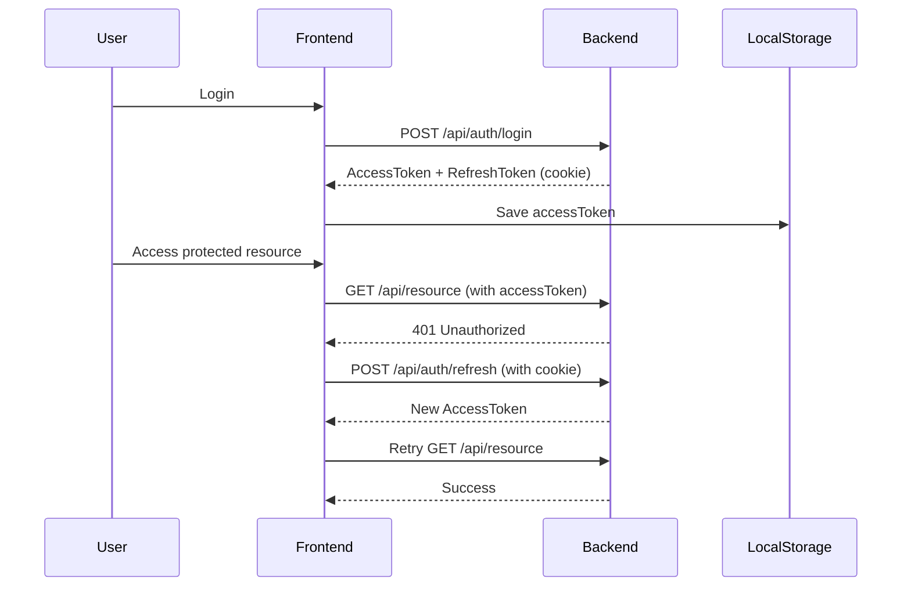

# 📋 API Integration - Summary

## ✅ Đã hoàn thành

### 1. **API Client & Configuration**

- ✅ Tạo Axios client với interceptors
- ✅ Auto token refresh khi 401
- ✅ Request/Response interceptors
- ✅ Cookie-based refresh token support
- ✅ Environment configuration (.env)

### 2. **Authentication Service**

- ✅ Register user
- ✅ Verify account
- ✅ Login (email/password)
- ✅ Google OAuth login
- ✅ Logout
- ✅ Forgot password
- ✅ Reset password
- ✅ Change password
- ✅ Token management
- ✅ Helper methods (isAuthenticated, getCurrentUser, etc.)

### 3. **TypeScript Types**

- ✅ Request DTOs (RegisterRequest, LoginRequest, etc.)
- ✅ Response DTOs (AuthResponse, User, etc.)
- ✅ API Response wrapper

### 4. **React Integration**

- ✅ useAuth custom hook
- ✅ ProtectedRoute component
- ✅ Login example component
- ✅ Register example component
- ✅ Google OAuth callback page

### 5. **Documentation**

- ✅ SETUP_GUIDE.md - Hướng dẫn setup chi tiết
- ✅ AUTH_API_GUIDE.md - API documentation
- ✅ API_README.md - Quick reference

---

## 📂 Cấu trúc thư mục

```
client/
├── service/
│   ├── api/
│   │   └── apiClient.ts              ← Axios client
│   ├── auth/
│   │   └── authService.ts            ← Auth methods
│   ├── config/
│   │   └── apiConfig.ts              ← Endpoints & config
│   ├── types/
│   │   └── auth.types.ts             ← TypeScript types
│   └── index.ts                      ← Export all
│
├── hooks/
│   └── useAuth.ts                     ← React hook
│
└── components/
    ├── auth/
    │   └── ProtectedRoute.tsx         ← Route protection
    └── examples/
        ├── LoginExample.tsx
        ├── RegisterExample.tsx
        └── GoogleCallbackPage.tsx
```

---

## 🎯 Cách sử dụng

### Option 1: Dùng Hook (Recommended)

```tsx
import { useAuth } from "@/hooks/useAuth";

function MyComponent() {
  const { login, logout, loading, error } = useAuth();

  const handleLogin = async () => {
    const result = await login({ email, password });
    if (result) {
      // Success
    }
  };
}
```

### Option 2: Dùng Service trực tiếp

```tsx
import { authService } from "@/service";

const handleLogin = async () => {
  try {
    const response = await authService.login({ email, password });
    console.log("User:", response.user);
  } catch (error) {
    console.error("Failed:", error);
  }
};
```

---

## 🔐 Backend Endpoints Supported

| Endpoint                    | Method | Description           | Status |
| --------------------------- | ------ | --------------------- | ------ |
| `/api/auth/register`        | POST   | Đăng ký tài khoản     | ✅     |
| `/api/auth/confirm`         | POST   | Xác thực email        | ✅     |
| `/api/auth/login`           | POST   | Đăng nhập             | ✅     |
| `/api/auth/logout`          | POST   | Đăng xuất             | ✅     |
| `/api/auth/refresh`         | POST   | Refresh token         | ✅     |
| `/api/auth/forgot-password` | POST   | Quên mật khẩu         | ✅     |
| `/api/auth/reset-password`  | POST   | Reset mật khẩu        | ✅     |
| `/api/auth/change-password` | POST   | Đổi mật khẩu          | ✅     |
| `/api/auth/url`             | POST   | Get Google OAuth URL  | ✅     |
| `/api/auth/callback`        | GET    | Google OAuth callback | ✅     |

---

## ⚙️ Configuration

### File `.env`:

```env
VITE_API_BASE_URL=http://localhost:8080
```

**Production:**

```env
VITE_API_BASE_URL=https://your-api-domain.com
```

---

## 🧪 Testing

### 1. Khởi động Backend

```bash
# Spring Boot
./mvnw spring-boot:run
```

### 2. Khởi động Frontend

```bash
pnpm dev
```

### 3. Test Flow

1. Register → `/register`
2. Verify → Check email for code
3. Login → `/login`
4. Access protected pages
5. Logout

---

## 🔄 Token Flow



---

## 📱 Integration với Code hiện tại

### Trong `Index.tsx`:

**Thay thế:**

```tsx
const [isLoggedIn, setIsLoggedIn] = useState(false);
useEffect(() => {
  const loggedIn = localStorage.getItem("isLoggedIn") === "true";
  setIsLoggedIn(loggedIn);
}, []);
```

**Bằng:**

```tsx
import { authService } from "@/service";
const isLoggedIn = authService.isAuthenticated();
const user = authService.getCurrentUser();
```

---

## 🛡️ Security Features

✅ **HttpOnly Cookies** - Refresh token không thể access từ JavaScript  
✅ **Auto Refresh** - Tự động refresh token khi hết hạn  
✅ **CSRF Protection** - State parameter trong OAuth  
✅ **Secure Storage** - Tokens stored safely  
✅ **Auto Logout** - Logout khi refresh fails

---

## 📞 Troubleshooting

### CORS Error

- Backend cần enable CORS cho frontend URL
- Check `@CrossOrigin` annotation in Spring Boot

### 401 Unauthorized

- Check accessToken in localStorage
- Check refresh_token cookie
- Verify token expiration

### Network Error

- Backend có đang chạy không?
- URL trong `.env` đúng chưa?
- Check console logs

---

## 🎓 Next Steps

1. ✅ **API đã sẵn sàng** - Tất cả endpoints đã được implement
2. ⏳ **Tích hợp vào components** - Thay thế logic cũ bằng services mới
3. ⏳ **Test với Backend** - Chạy backend và test flow
4. ⏳ **Add loading states** - UI feedback khi call API
5. ⏳ **Add error handling** - Toast notifications cho errors
6. ⏳ **Add vehicle, booking APIs** - Tương tự auth pattern

---

## 📚 Files để đọc tiếp

1. **SETUP_GUIDE.md** - Chi tiết setup và integration
2. **AUTH_API_GUIDE.md** - Chi tiết từng API method
3. **client/service/** - Source code để tham khảo
4. **client/components/examples/** - Example components

---

**Status:** ✅ **READY TO USE**

Tất cả API services đã sẵn sàng để tích hợp với backend của bạn!
